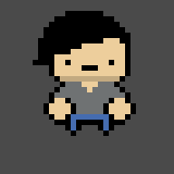
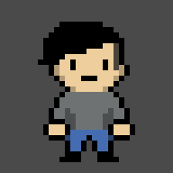
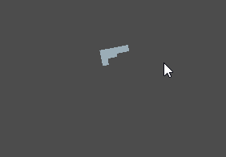

A couple weeks ago, I came up with an idea for a story-driven bullet hell game. You, the player, live in a town full of
interesting NPCs with their own developing storylines (something like Night in the Woods), and you regularly go on
missions to defeat various monsters, with combat mechanics similar to Enter the Gungeon. I'm calling it "Bullet Town"
for now because it's a bullet hell game that takes place in a town (I know, I'll change it when I think of something
better).

There are a few interesting mechanics I have in mind, like permanently destructible environments and maybe even
preventable NPC deaths that affect the story.

I have a full-time day job and I'll be creating all the art, code, and maybe even audio and music myself, so my progress
will be relatively slow, but I'll aim make progress posts like this every few 2-3 weeks.

## Art

The first thing I did was draw the player character, which is currently a little portrait of myself, because that's
always fun. Enter the Gungeon (EtG) was the first to come to mind when thinking of the art style for my game, so I
copied the character art style from that game as a starting point. Here's my first attempt at drawing the player
character:



After an unsuccessful attempt to draw an EtG-like character of a non-femme woman without it looking super butch, I did a
second pass to make it look less EtG-like and slightly less manly (but not really):



I realized that the hands would need to be detached so that they could move with the character's gun as you aim, like in
EtG. The next step will be changing the character's torso to make it look acceptable that it has no arms. I'm also
thinking of having all the characters be animals (again, like in Night of the Woods). I wonder what animal the player
character would be?

## Code

After creating a Godot Engine project and [GitHub repo](https://github.com/robyn3choi/bullet-town), I decided to
implement some basic player movement as a simple first step. I copied the player movement code from
[HeartBeast's Godot RPG tutorial series](https://www.youtube.com/playlist?list=PL9FzW-m48fn2SlrW0KoLT4n5egNdX-W9a) and
stripped out some of the details, as well as adding WASD and left joystick controls to the project's Input Map.

```GDScript
# Player.gd
extends KinematicBody2D

const speed = 170
var velocity = Vector2.ZERO

func _physics_process(delta):
	var input_vector = Vector2.ZERO
	input_vector.x = Input.get_action_strength('ui_right') - Input.get_action_strength('ui_left')
	input_vector.y = Input.get_action_strength('ui_down') - Input.get_action_strength('ui_up')
	input_vector = input_vector.normalized()

	if input_vector != Vector2.ZERO:
		velocity = input_vector * speed
	else:
		velocity = Vector2.ZERO

	velocity = move_and_slide(velocity)
```


<br/>

I also started working on the aiming mechanic. This was a bit tricky because the gun needs to flip vertically when it
reaches certain points in the rotation so that it never ends up upside-down.

```GDScript
# Gun.gd
extends Node2D

func _input(event):
	if event is InputEventMouseMotion:
		look_at(event.position)

		# keep rotation_degrees between 0 and 360
		rotation_degrees = fposmod(rotation_degrees, 360.0)

		if rotation_degrees > 90 && rotation_degrees < 270:
			$Sprite.flip_v = true
		else:
			$Sprite.flip_v = false
```



## Further Ramblings

I've felt creatively stifled for the past few years, what with my full-time job and general "adulting" taking up most of
my already low energy supply. A couple weeks ago, I had a day off work on Remembrance Day, so I took the opportunity to
have a much needed creative brainstorm. And thus, Bullet Town was born.

I've worked on several tiny games in my spare time and at game jams, but I haven't ever had a long-term passion project
like this one is going to be. I've worked on bigger games in game studios before, so I've seen how much work needs to go
into making a legit game, even if it's a small indie project. It's extremely daunting, and will likely take 2-3 years to
finish, but I'm hoping to follow through and create something that's playable to the end!
