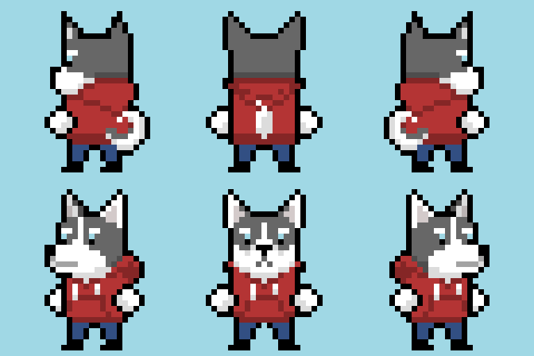
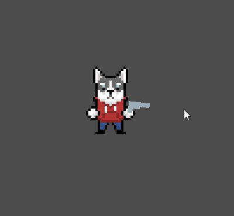
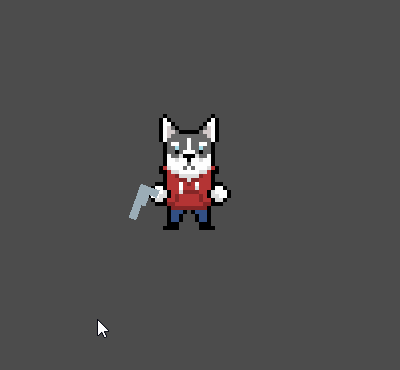
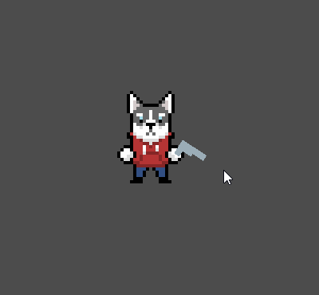

In my last post, I said that I'd post an update every 2-3 weeks. It's been about 2 months now so I apologize for that!
It's been a hectic couple months for me, but I'm planning to post more regularly and even start a YouTube channel for
this in 2021. I'm tempted to ramble about the happenings of my life in 2020, but I think we've all done enough
reflecting on this trashpile of a year so let's get right into it.

## Art

I decided that I wanted all the characters to be animals, like in Night in the Woods. I love dogs, so I drew the player
character as the first dog that came to mind, which for some reason turned out to be a Siberian Husky. I haven't really
interacted with any but they look pretty cool. There's still a lot of refining to do, but here's what the player looks
like from all possible angles:



My next step will be creating running animations for the player. I don't have much experience with pixel art animation
but I'm looking forward to figuring it out.

## Code

I continued implementing the aiming mechanic, imitating Enter the Gungeon with how gun rotates and switches hands.
Here's how it looks with a static player sprite:



Things are going to get very technical in this post, so I encourage you to
[clone this commit of the project](https://github.com/robyn3choi/bullet-town/tree/ec40ee7b1373e7edf863156eed84e53bff7185e9)
and follow along so that you can see the node hierarchy and better understand what's going on. To play around with the
aiming mechanic, open and play the `Player.tscn` scene.

Go ahead and open `Gun.tscn` and take a quick look at the node hierarchy before we jump into `Gun.gd`. Here's the main
logic in that script:

```GDScript
# Gun.gd
extends Node2D

export var left_pos: Vector2
export var right_pos: Vector2

var is_on_right = true
var switch_buffer = 40
var switch_disable_distance = 500
onready var muzzle_offset_y = $Sprite/Muzzle.global_position.y - global_position.y

func _ready():
	position = right_pos

func _input(event):
	if event is InputEventMouseMotion:
		# keep rotation_degrees between 0 and 360
		rotation_degrees = fposmod(rotation_degrees, 360.0)
		var is_switch_disabled = is_switch_disabled()

		if should_be_on_right() && !is_on_right && !is_switch_disabled:
			switch_to_right()
		elif !should_be_on_right() && is_on_right && !is_switch_disabled:
			switch_to_left()

		look_at_aim_point(event.position)
```

`left_pos` and `right_pos` are the positions of the player's left and right hands (from our point of view, not the
character's). The gun's position switches between these when certain rotation degrees are reached.

### Switching hands

This function determines whether the gun has reached the rotation threshold to switch hands:

```GDScript
func should_be_on_right():
	if is_on_right:
		return rotation_degrees <= 90 + switch_buffer || rotation_degrees > 270 - switch_buffer
	else:
		return rotation_degrees <= 90 - switch_buffer || rotation_degrees > 270 + switch_buffer
```

When `rotation_degrees` is 0, the gun is pointing straight to the right. This means that when `rotation_degrees` is 90,
it's pointing down, and when `rotation_degrees` is 270, it's pointing up. So if
`rotation_degrees <= 90 || rotation_degrees > 270`, the gun is pointing toward the right and should be in the right
hand. Otherwise, it should be in the left hand.

### The switch buffer

So what's `switch_buffer` doing in there? In the gif above, you'll notice that the gun doesn't switch hands right when
the cursor crosses the 90° or 270° threshold. There's actually a buffer of 40° where the gun will not stay on its
current hand. Without this buffer, the gun would rapidly switch back and forth between hands when its rotation was near
the switch threshold. This is because the gun's rotation changes when it switches hands, since it needs to continue
pointing at the cursor. So if the gun is on the right and reaches 90°, it would switch to the left and rotate so that
it's aiming at the cursor, but now its rotation is actually less than 90°. Here's what happens without this buffer:



### Disabling the hand switch

Even after all that, the buffer still wasn't enough to prevent this from happening when the cursor is close enough to
the player for the gun's rotation after switching hands to exceed the switch rotation threshold plus the buffer. This is
why I added `is_switch_disabled()`. When this function returns `true`, the gun will not switch hands even when the its
rotation is at a point where it normally would switch.

```GDScript
func is_switch_disabled():
	# switching hands is disabled when the mouse cursor is close enough to the gun
	var distance_to_aim_point = global_position.distance_squared_to(get_global_mouse_position())
	return distance_to_aim_point < switch_disable_distance
```

### Actually switching hands

This is how the gun actually switches hands:

```GDScript
func switch_to_left():
	# flip the sprite
	$Sprite.scale = Vector2(1, -1)
	# shift the sprite so it looks like it flipped along the bottom of the sprite instead of the middle
	$Sprite.position.y += $Sprite.texture.get_height()
	# go to the left hand
	position = left_pos
	is_on_right = false

func switch_to_right():
	$Sprite.scale = Vector2(1, 1)
	$Sprite.position.y -= $Sprite.texture.get_height()
	position = right_pos
	is_on_right = true

```

Without `$Sprite.position.y += $Sprite.texture.get_height()` and the inverse, this is what would happen (notice what
happens when the gun is on the left):



### Tweaking the gun's look_at

Finally, we need to actually point the gun at the cursor:

```GDScript
func look_at_target(cursor_pos):
	var look_at_pos = cursor_pos;
	var multipler = -1 if is_on_right else 1
	look_at_pos += transform.y * muzzle_offset_y * multipler
	look_at(look_at_pos)
```

`look_at` is a
[handy Node2D function](https://docs.godotengine.org/en/stable/classes/class_node2d.html#class-node2d-method-look-at)
that rotates an object to face a specified position, like a gun to its target. Unfortunately, getting the gun to point
to the cursor wasn't as simple as `look_at(cursor_pos)`. Here's what happened when I had only that one line of code:


It's subtle, but you'll see that the gun's muzzle is not pointing at the cursor. Because the gun object's origin is in
the handle of the gun, the handle is what points to the cursor when you use `look_at`. Take another look at the node
hierarchy in `Gun.tscn` and notice the position of the `Sprite` node in relation to the `Gun` node. I set it up this way
so that the gun would rotate around the handle as its pivot point.

To counteract this, I used a
[code snippet I found in the Unity forums](https://answers.unity.com/questions/674674/simple-lookat-rotation-with-offset-pivot.html)
(the first snippet in the first reply). It takes the distance between the gun's origin and the muzzle, and adds it to
the cursor position (or subtracts it, depending on which side the gun is on). Then `look_at` is called with the new
target position.
