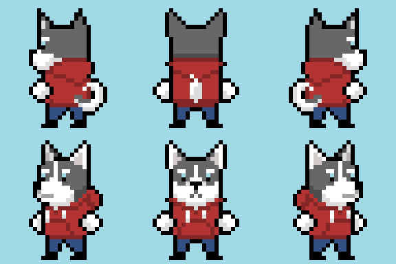
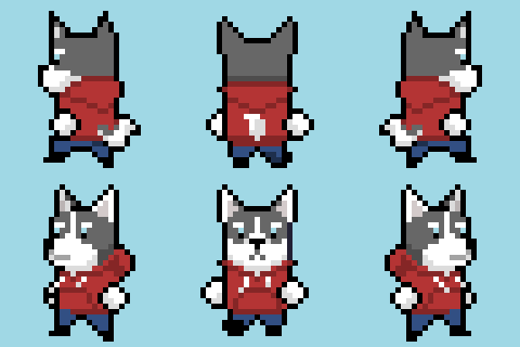

_Edit: Corrected the GitHub link in the Code section._

This is going to be a short one, as most of my progress this month was done on creating the 'run' and 'idle' animations
instead of coding. Here's a little clip of what it looks like:

`youtube: https://youtu.be/ySwO6sXHzag`

I started using a free app called [Clockify](https://clockify.me/) to track my time spent on art and code, including
doing research and watching tutorials. The times will be included at the bottom of the Art and Code sections in case
it's useful to any of you folks.

## Art

This was basically my first time creating pixel art animations, and I was surprised with how fast I finished the idle
animations.



But I had a MUCH more difficult time with the run animations, plus they had twice as many frames as the idle animations.
I'm fairly happy with how they turned out but I plan on revising all the art sometime in the future. Especially the 'run
up' animation (top-middle in the gif below).



My goal at this point is just to make art that's good enough to keep players immersed, and convey the right feel for the
game. But I do want to improve my pixel art so feedback is always welcome!

_~ Time spent: 14 hrs_

## Code

Feel free to download the project at
[this git commit](https://github.com/robyn3choi/bullet-town/tree/3895eaa64065c4dd95ff1fcc46440fc8397ce283) and play
around with it. There wasn't much actual code added, but I did spend quite a lot of time figuring out whether I should
use Godot's [AnimationTree](https://docs.godotengine.org/en/stable/tutorials/animation/animation_tree.html) node like in
[HeartBeast's animation tutorial](https://www.youtube.com/watch?v=Z9aR9IiiHT8&list=PL9FzW-m48fn2SlrW0KoLT4n5egNdX-W9a).
In the end, I decided that it was an overengineered solution for this point in development, but it could come in handy
later. Instead, I went with a simple approach of creating the animations in an AnimationPlayer node, and triggering them
directly in the code.

```GDScript
# Player.gd
extends KinematicBody2D

const speed = 50

onready var anim_player = $AnimationPlayer
var velocity = Vector2.ZERO
var last_input_vector = Vector2(0, 1)

func _physics_process(delta):
	var input_vector = Vector2.ZERO
	input_vector.x = Input.get_action_strength('ui_right') - Input.get_action_strength('ui_left')
	input_vector.y = Input.get_action_strength('ui_down') - Input.get_action_strength('ui_up')

	if input_vector != Vector2.ZERO:
		last_input_vector = input_vector
		play_anim('run')
		# input_vector needs to be normalized so that moving
		# diagonally doesn't move the player faster
		velocity = input_vector.normalized() * speed

	else:
		play_anim('idle')
		velocity = Vector2.ZERO

	velocity = move_and_slide(velocity)

func play_anim(action: String):
	match last_input_vector:
		Vector2(-1, 0), Vector2(-1, 1):
			anim_player.play(action + '_down-left')
		Vector2(0, 1):
			anim_player.play(action + '_down')
		Vector2(1, 0), Vector2(1, 1):
			anim_player.play(action + '_down-right')
		Vector2(-1, -1):
			anim_player.play(action + '_up-left')
		Vector2(0, -1):
			anim_player.play(action + '_up')
		Vector2(1, -1):
			anim_player.play(action + '_up-right')
```

One major downside for this approach is that it relies on the names of the animations. I plan on keeping the animation
naming consistent, so this should work for the foreseeable future. It may not the best long-term solution when animation
interactions become more complex, so maybe I'll try out AnimationTree again when the time comes.

Also, gamepad input isn't working correctly, so I'm going to figure that out for my next post.

_~ Time spent: 2.75 hrs_

## Further Ramblings

Initially, I was surprised at how low the number of hours I spent on this project was - only 16.75 hours over the past
month. I felt a bit better when I realized it averages out to just over 30 min of work every day, but I'd definitely
like to do closer to 1 hour per day.

I'm hoping to pick up the pace in March. My partner and I will have moved into our new place, and I'll be starting a
YouTube channel around that time. I think the novelty will help motivate me to spend some more time on this after work.
And winter will _finally_ be over!
