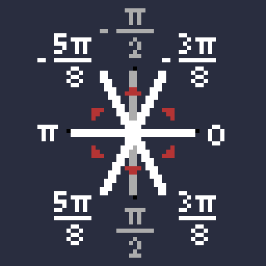
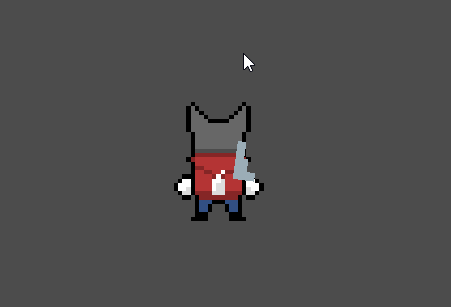
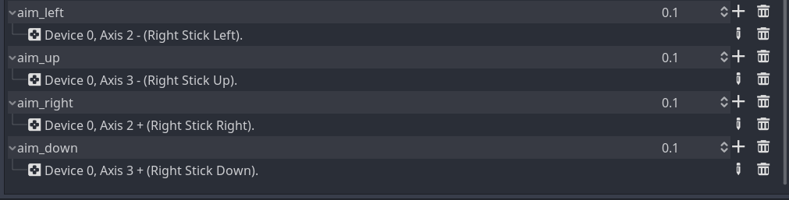

_It's been a while since my last post, and I'll talk about why in the Further Ramblings section at the bottom. But
before getting started, I should mention that I've made the GitHub repo for this project private. I hope this doesn't
deter anyone's interest in this project, and I hope that these devlogs/tutorials are clear enough to help you if you're
making a similar game. If not, feel free to let me know how I can improve!_

Now that that's over with, I'm going to show you how I made the player character face the direction their gun is aiming
while running, handling input from both mouse and gamepad.

When you're not holding a weapon, it's straightforward. You just face the direction you run in. Here's a clip from
[Devlog #3](/posts/game-devlog-3/) showing this:

`youtube: https://youtu.be/ySwO6sXHzag`

<br/>
When you're holding a weapon, not only do you need to face the direction you're aiming in, you need to run backwards if
you're facing the opposite direction. Here's what the end result looks like:

`youtube: https://youtu.be/L7U1zTAngJk`

(Yes, you saw correctly, the player's gun can shoot bullets now too, but we'll get into that next time.)

Sadly, I haven't worked on art since my last post. I'm pretty satisfied with how the player character looks right now,
but I'm planning on incorporating your art feedback in the future (don't worry!). So I'm going to focus on developing
gameplay, at least until I get bored of how the game looks.

## Code

We have a dictionary, `DirectionString`, with the 8 directions as keys and the corresponding animation suffixes as
values. In case you haven't read [Devlog #3](/posts/game-devlog-3/), the player animations have names that follow the
pattern "[action]\_[direction]". For example, "idle_down" and "run_up-left".

`DirectionString` is stored in a `Globals` script which is in the project's
[AutoLoad](https://docs.godotengine.org/en/stable/getting_started/step_by_step/singletons_autoload.html) so that it can
be accessed in any scene. In the future, NPC animations will probably need to use this dictionary for their own
movement/animation code.

```GDScript
# Globals.gd
extends Node

const DirectionString = {
	Vector2(-1, 0): "down-left",
	Vector2(-1, 1): "down-left",
	Vector2(0, 1): "down",
	Vector2(1, 1): "down-right",
	Vector2(1, 0): "down-right",
	Vector2(-1, -1): "up-left",
	Vector2(0, -1): "up",
	Vector2(1, -1): "up-right"
}
```

Note that because my player animation doesn't include straight `left` and `right` directions, they are replaced by
`down-left` and `down-right`. `DirectionString` will be used in `Player.gd` to play the correct animations.

### Mouse aiming

Let's start with getting the player character to face in the direction of the mouse cursor. We can use `_input()` to
detect mouse motion and determine the angle between the player and the cursor. This angle determines which direction the
player will face, which then determines which animation should play. This angle and the mouse's position are also passed
into the `Gun` node to make the gun point to the cursor (more on that further down below).

```GDScript
# Player.gd

# giving Globals.DirectionString a shorter name for this file
var DirString = Globals.DirectionString

func _input(event):
	if event is InputEventMouseMotion:
		is_using_joystick = false
		var angle_to_cursor = get_angle_to(event.position)

		mouse_direction.x = 0
		if angle_to_cursor >= -PI*3/8 && angle_to_cursor < PI*3/8:
			mouse_direction.x = 1
		elif angle_to_cursor > PI*5/8 || angle_to_cursor < -PI*5/8:
			mouse_direction.x = -1

		mouse_direction.y = -1 if angle_to_cursor > -PI && angle_to_cursor < 0 else 1

		if is_wielding: gun.aim_with_mouse(angle_to_cursor, event.position)

func _physics_process(delta):
	anim_player.play("idle_" + DirString[mouse_direction])
```

What's with the `PI*3/8` and `PI*5/8`? There needs to be a range where `mouse_direction.x` will be 0 so that the player
can face straight up or down. Here's a diagram showing the angles (white lines) between each of the 8 directions (red
triangles). Imagine the player in the centre:



So the player will face `down` when the angle is between and `PI*3/8` and `PI*5/8`, `down-left` when the angle is
between `PI*5/8` and `PI`, you get the idea.

The gun aiming code was quite straightforward since the heavy lifting was done in [Devlog #2](/posts/game-devlog-2/).
Because the aiming is now done relative to the player's position instead of the gun's position, it simplified things and
I was able to remove the "switch buffer" and "disable switch" functionality.

```GDScript
# Gun.gd

# called by Player.gd whenever the mouse moves
func aim_with_mouse(angle_to_cursor, cursor_pos):
	switch_sides_if_needed(angle_to_cursor)
	look_at_target(cursor_pos)

func switch_sides_if_needed(aim_angle):
	var is_aiming_right = true if aim_angle >= -PI/2 && aim_angle < PI/2 else false
	if is_aiming_right && !is_on_right:
		switch_to_right()
	elif !is_aiming_right && is_on_right:
		switch_to_left()

# switch_to_right(), switch_to_left(), look_at_target() are explained in Devlog #2
```

<br/>
Here's what we have so far:



### Gamepad aiming

Let's look at the gamepad version of the above before moving onto running while aiming. This code makes the player face
in the direction of the right joystick.

```GDScript
# Player.gd
func _physics_process(_delta):
	var joystick_direction = Vector2(
		int(Input.is_action_pressed('aim_right')) - int(Input.is_action_pressed('aim_left')),
		int(Input.is_action_pressed('aim_down')) - int(Input.is_action_pressed('aim_up')))

	if joystick_direction != Vector2.ZERO:
		last_joystick_direction = joystick_direction
		is_using_joystick = true

	var facing_direction = last_joystick_direction if is_using_joystick else mouse_direction
	anim_player.play("idle_" + DirString[facing_direction])

	if is_wielding && is_using_joystick && joystick_direction != Vector2.ZERO:
		gun.aim_with_joystick()
```

Instead of getting the angle between the player and the target, we only need to get the joystick input. We use
`int(Input.is_action_pressed())` to get 8-directional rather than continuous values. `joystick_direction` can then be
used to determine which animation plays.

We store the `last_joystick_direction` because the player needs to stay facing/aiming in the same direction when you let
go of the joystick.

Because we're storing `is_using_joystick`, we can have `facing_direction` determined by the joystick or mouse, depending
on which was last used.

Rather than use the `Input` class like `Input.get_joy_axis(0, JOY_AXIS_2)` to get the joystick input, I added these
entries in the project's Input Map:



In `Gun.gd`, we want the continuous values from the joystick, or else you would only be able to aim in 8 discrete
directions. So instead of `int(Input.is_action_pressed())`, we use `Input.get_action_strength()`. Then we just set the
gun's rotation to the angle joystick input's resulting angle.

```GDScript
# Gun.gd

# called by Player.gd every frame if there is right joystick input
func aim_with_joystick():
	var joystick_input = Vector2(
		Input.get_action_strength('aim_right') - Input.get_action_strength('aim_left'),
		Input.get_action_strength('aim_down') - Input.get_action_strength('aim_up'))

	var aim_angle = joystick_input.angle()
	switch_sides_if_needed(aim_angle)
	rotation = aim_angle
```

There's no demo gif for this part because it looks exactly the same as the one for mouse aiming, except there's no
mouse. (Gotta keep the page load time down!)

### Running while aiming

When the player is running in one direction but aiming in another direction, the animation needs to play in reverse to
make the player appear to run backwards (see the "Devlog #3 - Running while aiming" video at the top of this post).
Let's add the movement code to `Player.gd`'s `_physics_process()` and introduce some new methods.

```GDScript
# Player.gd
func _physics_process(_delta):
	var move_direction = Vector2(
		int(Input.is_action_pressed('ui_right')) - int(Input.is_action_pressed('ui_left')),
		int(Input.is_action_pressed('ui_down')) - int(Input.is_action_pressed('ui_up')))

	if move_direction != Vector2.ZERO: last_move_direction = move_direction

	var velocity = move_direction.normalized() * speed
	move_and_slide(velocity)

	var joystick_direction = Vector2(
		int(Input.is_action_pressed('aim_right')) - int(Input.is_action_pressed('aim_left')),
		int(Input.is_action_pressed('aim_down')) - int(Input.is_action_pressed('aim_up')))

	if joystick_direction != Vector2.ZERO:
		last_joystick_direction = joystick_direction
		is_using_joystick = true

	play_anim(move_direction, get_facing_direction())

	if is_wielding && is_using_joystick && joystick_direction != Vector2.ZERO:
		gun.aim_with_joystick()


func get_facing_direction():
	var facing_direction = last_move_direction
	if is_wielding:
		facing_direction = last_joystick_direction if is_using_joystick else mouse_direction
	return facing_direction

func play_anim(move_direction, facing_direction):
	if move_direction == Vector2.ZERO:
		anim_player.play("idle_" + DirString[facing_direction])
	else:
		if should_play_anim_backwards(move_direction, facing_direction):
			anim_player.play_backwards("run_" + DirString[facing_direction])
		else:
			anim_player.play("run_" + DirString[facing_direction])

func should_play_anim_backwards(move_direction, facing_direction):
	# one y is 1 and the other is -1, and x's don't match
	# one x is 1 and the other is -1
	# moving straight up or down and aiming in opposite direction
	return ((abs(move_direction.y - facing_direction.y) == 2 && move_direction.x != facing_direction.x)
			|| (abs(move_direction.x - facing_direction.x) == 2)
			|| (move_direction.x == 0 && move_direction.y != facing_direction.y))
```

In `get_facing_direction()`, if the player isn't holding a weapon (`is_wielding == false`), then the facing direction
should just be the direction the player is moving in, ignoring the right joystick and mouse position (see the "Devlog
#3 - Run and Idle Animations" video at the top of this post).

The trickiest part was implementing `should_play_anim_backwards()`. Through trial and error, I found 3 conditions where
the animation should play backwards. They are included as comments in that method.

These conditions will differ depending on how you animate your character. For example, my player animation is
8-directional plays the same animation for the "left" and "down-left" directions, but yours might have separate
animations for the "left" and "right" directions, be 4-directional, etc.

_~ Time spent: 8 hrs_

## Further Ramblings

My February was 100% taken up by preparing for the move, moving, and organizing things after the move. I also had the
_genius_ idea of job hunting at the same time because "it'd be nice to have a fresh start at a new company right after
the move!". Add on the stresses of being a new homeowner and some extreme buyer's remorse, and it became one of the most
stressful months I've ever had.

I acknowledge that it's a privilege to be able to own a home and that it was only possible because we had help from our
families, but I'm thinking of going back to renting after we sell this place. It's just so much simpler (and probably
cheaper).

Anyway, I've finally had some time to breathe this past week. I delayed the start date of my new job until April so that
I could catch up on projects, build some good habits, and basically enjoy life before re-entering the rat race!
